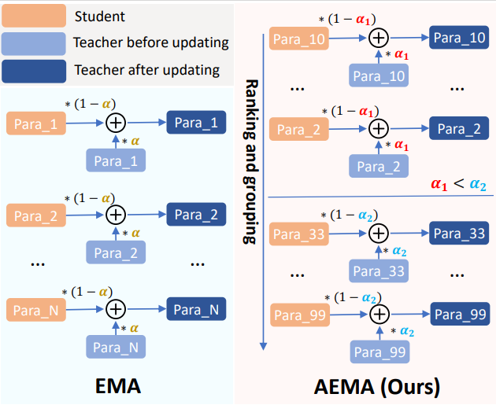
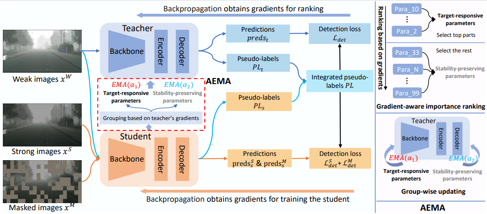

# Dual-Rate Dynamic Teacher for Source-Free Domain Adaptive Object Detection

The core contribution is AEMA, which update teacher parameters in asynchronous manner.
<!-- 
 -->
 <div align="center">

</div>

The framework of the proposed Dual-Rate Dynamic Teacher in the following figure.

<!--  -->
 <div align="center">

</div>

## Environment Setup

```bash
conda create -n ddt python=3.8
conda activate ddt
conda install pytorch==1.12.0 torchvision==0.13.0 torchaudio==0.12.0 cudatoolkit=11.3 -c pytorch
pip install -r requirements.txt

# Compiling and testing Deformable DETR CUDA operators
cd models/ops
bash make.sh
python test.py
```

## Dataset

Ours method used 3 popular SF-DAOD benchmarks:

- city2foggy: Cityscapes (source domain) → FoggyCityscapes with foggy level 0.02 (target domain).
- sim2city: Sim10k (source domain) → Cityscapes with `car` class (target domain).
- city2bdd: Cityscapes (source domain) → Bdd100k-daytime (target domain).

<!-- The raw data can be download from the official websites: [Cityscapes](https://www.cityscapes-dataset.com/downloads/),  [FoggyCityscapes](https://www.cityscapes-dataset.com/downloads/),  [Sim10k](https://fcav.engin.umich.edu/projects/driving-in-the-matrix), [Bdd100k](https://bdd-data.berkeley.edu/). The annotations are converted into COCO style, can download from [here](https://drive.google.com/file/d/1LB0wK9kO3eW8jpR2ZtponmYWe9x2KSiU/view?usp=sharing) (provided by [MRT-release](https://github.com/JeremyZhao1998/MRT-release)). The datasets are organized as: -->

- data
    - cityscapes
        - annotations
        - leftImg8bit
            - train
            - val
    - foggy_cityscapes
        - annotations
        - leftImg8bit_foggy
            - train
            - val 
    - bdd100k
        - annotations
        - images
            - 100k

## Training

```bash
bash configs/def-detr-base/city2foggy/teaching_mask_ddt.sh
```
The training log file of city2foggy (best mAP = 45.9) is available at [log file](docs/city2foggy_log.txt)